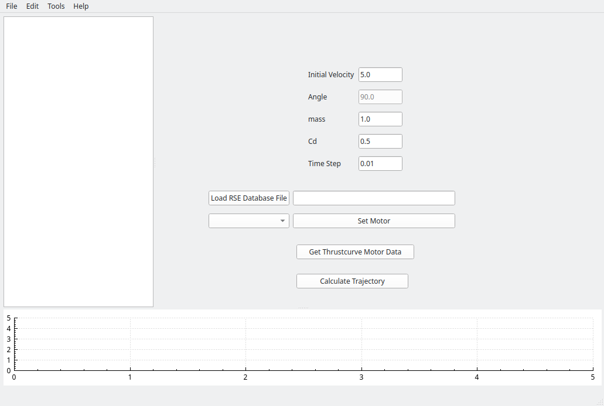
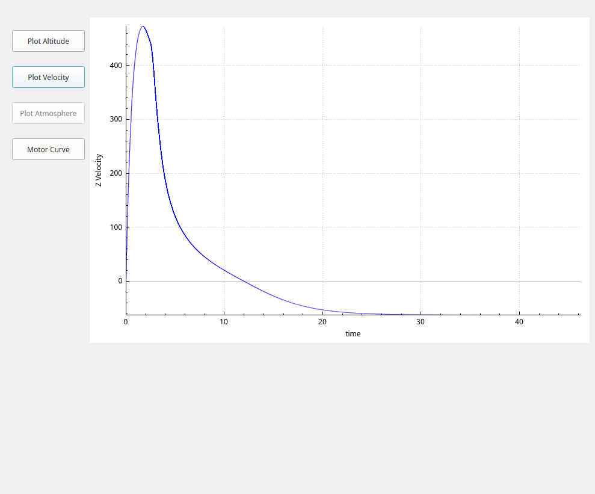
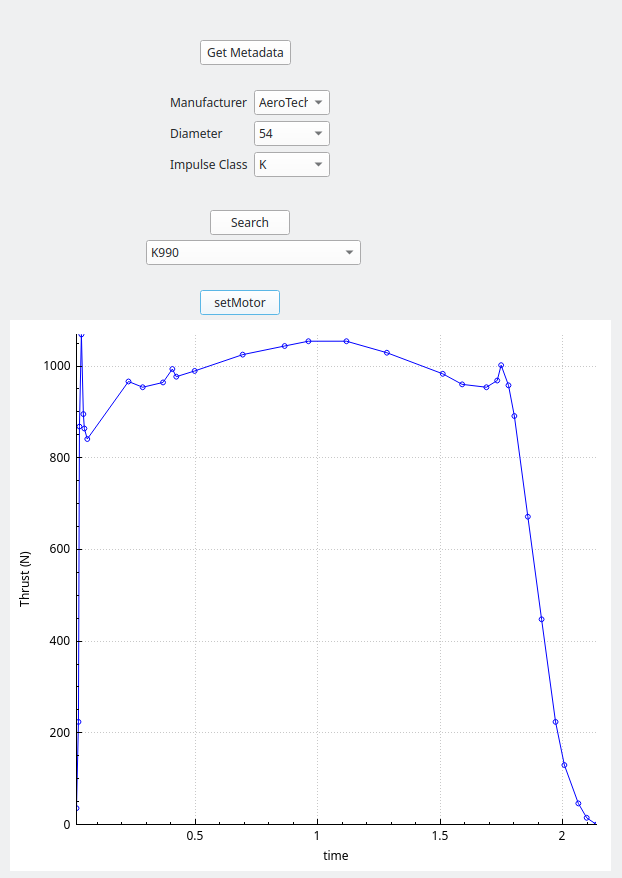

# qtrocket
An open source model Rocket Simulator written in C++ and Qt Toolkit, coming soon!

## Why?
Because it's fun! Model and High Power rocketry are enjoyable hobbies that teach model building
and inspire people to keep learning. For me, part of that learning process includes learning more
about the aerodynamics of rocket flight, and what better way to learn than write a simulator?

There are already open source rocket simulators out there (e.g. OpenRocket), but this is another
take on that idea. For one, this is written in C++ and OpenRocket is written in Java, but more 
importantly, I hope to engineer this in a way that is as modular as possible from the standpoint
of the parts, components, and concepts involved in modeling a rocket. That way, this can serve not
only as a model rocket design program, but a platform for people to learn about how rockets fly,
and might serve as a learning platform not just for me, but for others as well.

### Why Release An Unfinished Product?
Well, first of all it isn't actually *released* yet. But it is public because I'm always interested in getting any feedback others may have. I'm doing this to learn as well, and if you have any
pointers, I'd love to hear them! And if you want to contribute, well, please do! Let's talk :)

## How To Use It
First, it's still in the very early stages of development, but it *can* propagate objects through
an atomosphere with a given coefficient of drag, mass, and motor.

When you first open qtrocket, you're presented with the main window:

The main window thus far has been centered around testing the core physics engin. As you can see,
there are several fields that you can edit:
* Initial Velocity - This is an initial vertical velocity off the launch rod or rail
* Angle - Currently disabled. If the rocket launches at an angle, this would be it. Currently
it is disabled and set at 90 degrees from horizontal, aka vertical.
* mass - The mass of the rocket in kilograms (not including the motor)
* Cd - The coefficient of drag of the rocket
* Time Step - The time step used by the simulator, in seconds. Defaults to 0.01 seconds.

Once you fill out these fields (or just accept their defaults), you are ready to load a motor. The
"Load RSE Database File" button will open a file browser to allow you to select a RockSim
engine database file. One is included in the data/ directory of qtrocket that holds some AeroTech 
motors. After selecting a motor, you can click on the "Set Motor" button. This will add the selected
motor to the rocket, and use it to launch the rocket.

Once you have selected and added the rocket motor, click "Calculate Trajectory". A new dialog will
appear (if the plot is empty, just click the "Plot Altitude" button):

From here you can also plot velocity by clicking "Plot Velocity":

And, plot the thrust curve of the motor you selected.

## Thrustcurve.org integration
There is another feature, in that qtrocket integrates with the excellent online motor database thrustcurve.org. From the main window, click "Get Thrustcurve Motor Data". A new window will open:

In order to use it, you first must click "Get Metadata". Then you can select the manufacturer, motor diameter, and impulse class.

After filling out those combo boxes, click "Search". From there, you can search all available
motors with those criteria. After choosing one in the combo box, click "setMotor", and that
motor's thrust curve will be displayed in the plot.

## Known Issues
* It doesn't do much
   * I know, but it's just a little fella and it's still growing ;)
